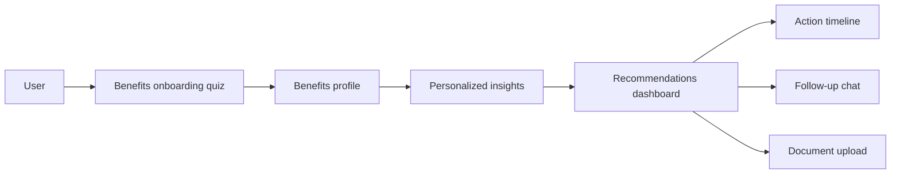

# FinMate

AI-assisted benefits advisor built for the AWS/Lincoln Financial codeLinc hackathon.

**🏆 2nd Place - AWS/Lincoln Financial codeLinc 10**

[Devpost](https://devpost.com/software/finmate-gj93c8) | [Demo Video](https://drive.google.com/file/d/1hkhcIgm4Zcieez5crlFHQOdEZvJp7dqg/view?usp=sharing) | [Hackathon](https://codelinc10.devpost.com/)

## Overview

FinMate helps early-career employees make better decisions around workplace benefits, savings, insurance, and retirement planning.

The app guides users through a short onboarding flow, builds a benefits profile, and returns personalized recommendations, priority actions, timelines, and follow-up chat support. It was built as a hackathon prototype for making benefits selection feel less like reading a policy packet and more like getting a clear financial roadmap.

## My role

This was a team project. My main contributions were:

* Built the onboarding-to-insights flow that transformed user benefits inputs into structured profile data, recommendation outputs, timelines, and priority actions
* Helped wire the prototype around AWS integration points, including Lambda/API Gateway flows, S3-style document upload handling, DynamoDB-ready persistence, and Bedrock-backed AI guidance
* Connected frontend state and Next.js API routes for generated insights, chat support, report behavior, and upload workflows
* Worked across the React/TypeScript product experience, including quiz, insights, timeline, learning, upload, and profile screens
* Helped prepare the final demo, technical architecture explanation, and product framing for the AWS/Lincoln Financial judging panel

## Tech stack

| Area      | Tools                                              |
| --------- | -------------------------------------------------- |
| Frontend  | Next.js, React, TypeScript                         |
| Styling   | Tailwind CSS, Radix UI, lucide-react               |
| Animation | Framer Motion                                      |
| Forms     | React Hook Form, Zod                               |
| Charts    | Recharts                                           |
| Backend   | Next.js API routes, Node.js                        |
| Cloud     | AWS Lambda, API Gateway, S3, DynamoDB              |
| AI        | AWS Bedrock, Claude, AI chat routing               |
| Data      | Browser local storage, prototype server-side store |
| Testing   | Vitest                                             |
| Tooling   | ESLint, Prettier, GitHub Actions                   |

## Product flow



## System architecture


The hackathon prototype used a Next.js product layer with AWS-ready integration points for document upload, storage, and AI guidance.

## Key features

* Guided onboarding quiz for benefits, healthcare, savings, retirement, dependents, and risk preferences
* Personalized recommendations based on the user’s profile and stated priorities
* Priority guidance that turns benefits choices into specific next actions
* Timeline view for planning enrollment and follow-up decisions
* Visual insights dashboard for seeing how benefits choices affect financial allocation
* AI chat support for follow-up benefits and financial planning questions
* Document upload prototype for future benefits document analysis

## Product screenshots

### Landing Page


### Recommendations and Visual Insights


## How it works

1. The user completes a short benefits onboarding flow.
2. FinMate turns those answers into a structured financial and benefits profile.
3. The app generates priority recommendations, plan guidance, and action timelines.
4. The user can explore visual insights, ask follow-up questions, or upload documents.
5. The prototype connects the product experience to backend routes and AWS-ready integration points.

## Running locally

```bash
git clone https://github.com/SujayCh07/finmate-ai-benefits-advisor.git
cd finmate-ai-benefits-advisor/codelinc10
npm install
npm run dev -- -p 3002
```

Open:

```text
http://localhost:3002
```

Useful commands:

```bash
npm run build
npm run lint
npm run typecheck
npm run test
```

## Environment variables

The project supports optional integrations for AI, cloud upload, and future persistence. Do not commit real keys.

| Variable                        | Purpose                          |
| ------------------------------- | -------------------------------- |
| `AI_API_URL`                    | Optional external AI endpoint    |
| `AI_API_KEY`                    | Optional external AI API key     |
| `CLAUDE_API_KEY`                | Optional Claude fallback key     |
| `CLAUDE_MODEL`                  | Optional Claude model override   |
| `LAMBDA_UPLOAD_URL`             | Optional document upload backend |
| `NEXT_PUBLIC_SUPABASE_URL`      | Optional Supabase placeholder    |
| `NEXT_PUBLIC_SUPABASE_ANON_KEY` | Optional Supabase placeholder    |
| `AWS_ACCESS_KEY_ID`             | Optional AWS local testing key   |
| `AWS_SECRET_ACCESS_KEY`         | Optional AWS local testing key   |
| `AWS_REGION`                    | Optional AWS region              |

## What I would improve

* Replace prototype local and in-memory storage with a production database layer
* Add document retrieval over uploaded benefits material
* Add stronger evaluation for recommendation quality and chat responses
* Move all sensitive cloud and AI calls behind server-side routes
* Add end-to-end tests for onboarding, insights, upload, and chat
* Improve observability around API errors, latency, and failed AI responses
